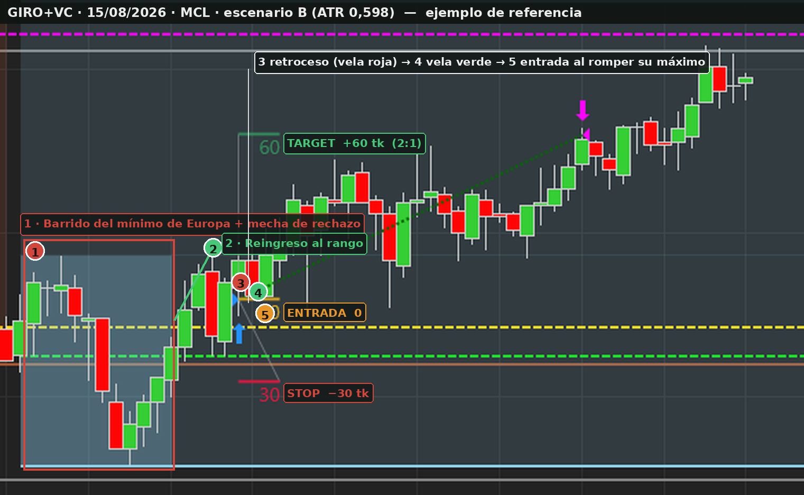

# Trading Plan Personal — v2

**Emiliano Arburua** · CL / MCL · Metodología Ankora
Basado en el TPP vigente y en el análisis de 97 operaciones reales (22/10/2025 → 26/06/2026).

> Estado: **completo**. Aplanado por no-overnight confirmado: **18:00 de Buenos Aires** (§7.1).

---

## 0 · Objetivo y horizonte

**Objetivo de esta etapa: validar las correcciones en 40–60 operaciones.**

El éxito de esta fase no se mide en dinero sino en dos números:

| Métrica | Hoy | Objetivo |
|---|---:|---:|
| R realizado | 1,53 | **≥ 1,85** |
| Winrate | 35,4 % | **≥ 35 %** (que no baje) |

Si el R sube a 1,85 y el winrate aguanta, el sistema es rentable y recién ahí tiene
sentido hablar de objetivos de dinero. Si el R sube pero el winrate cae por debajo del
33 %, la hipótesis está mal y hay que volver sobre la entrada.

**Vehículo: prueba de fondeo.** A ~1,2 operaciones por día, 50 operaciones son unos dos
meses de operativa.

---

## 1 · Gestión del riesgo

### 1.1 Instrumentos

CL y MCL. La elección no es por preferencia sino por volatilidad: define el escenario
(§1.3), y el escenario define el instrumento.

### 1.2 Riesgo por operación

**$150 fijos por operación.** El importe no se mueve dentro del mes; se recalcula el 1º de
cada mes según el capital de la cuenta.

Que sea fijo es justamente el punto: es lo que hace que los cuatro escenarios de §1.3
arriesguen exactamente lo mismo. **Este es el principio que no se negocia.**

### 1.3 Escenarios de volatilidad — **la tabla**

Se lee el **ATR(14) en M60** antes de la sesión. Ese número decide todo lo demás: no hay
nada que improvisar durante la operativa.

| ATR M60 | Escenario | Stop | Instrumento | Contratos | **Target** | Riesgo | Gana | Pierde |
|---|:-:|---:|:-:|---:|---:|---:|---:|---:|
| **< 500** | **A** | **15 tk** | CL | **1** | **30 tk** | $150 | +$294,68 | −$155,32 |
| **500 – 1000** | **B** | **30 tk** | MCL | **5** | **60 tk** | $150 | +$290,80 | −$159,20 |
| **1000 – 1250** | **C** | **50 tk** | MCL | **3** | **100 tk** | $150 | +$294,48 | −$155,52 |
| **1250 – 1500** | **D** | **75 tk** | MCL | **2** | **150 tk** | $150 | +$296,32 | −$153,68 |
| **> 1500** | — | **no se opera** | | | | | | |

El ATR se lee en la escala de la plataforma (milésimas de dólar): **500 = 0,500 = 50
ticks** de rango medio por hora.

El riesgo da **$150 exactos en los cuatro casos**: 15 × $10 = 30 × $5 = 50 × $3 = 75 × $2.
Esa igualdad es toda la corrección — el año pasado el riesgo real fue de $121,63 cuando la
operación ganaba y $155,79 cuando perdía, y esos 28 puntos de diferencia se llevaron el R
de 2,00 a 1,53.

**El stop es el del escenario, no el que pida el gráfico.** Si el pivote a proteger queda
más lejos que el stop de la tabla, la operación **no se toma**. Esta es la regla que más
operaciones va a descartar: sobre el histórico habrías tomado 68 de 96. Las 28 que quedan
fuera dieron 3 ganadoras y 9 perdedoras entre las de stop ancho, con −$518 de resultado,
así que el filtro no está dejando fuera nada bueno.

| | R neto | Winrate de equilibrio |
|:-:|---:|---:|
| A | 1,90 | 34,5 % |
| B | 1,83 | 35,4 % |
| C | 1,89 | 34,6 % |
| D | 1,93 | 34,2 % |

El escenario B es el menos eficiente: cinco micros pagan $9,20 de comisión contra los
$3,68 de dos. No hay nada que hacer al respecto —es el precio de operar con ATR medio—
pero conviene saber que ahí el margen es más fino.

### 1.4 Ratio

**2:1 siempre.** Comprobado sobre las capturas: las ganadoras alcanzaron entre 2,11R y
3,05R, con lo que el objetivo a 2R captura casi todo el movimiento disponible. Estirarlo a
2,5R habría convertido tres de cada cuatro ganadoras en pérdidas completas.

Si el pivote objetivo no permite 2:1 desde el stop del escenario, **no hay operación**.

### 1.5 Topes

| | |
|---|---|
| Operaciones por día | **máximo 2** |
| Pérdida diaria | **−2R (2 stops, $300) cierran el día** |
| Pérdida semanal | **−3R ($450) cierran la semana** |
| Pérdida mensual | **el drawdown de la cuenta de fondeo** (ver abajo) |

Después del segundo stop no se vuelve a mirar el gráfico hasta el día siguiente.

**Todo se cuenta en R.** Con ratio 2:1, cada ganadora suma **+2R** y cada perdedora
**−1R**. El tope semanal es sobre el **neto acumulado de la semana**, no sobre las
pérdidas sueltas: si la semana está en +2R y después perdés, seguís operando; sólo se
cierra la semana cuando el neto toca **−3R**.

| Semana | Neto | ¿Sigo? |
|---|---:|:-:|
| 1 perdedora | −1R | sí |
| 1 perdedora + 1 ganadora | +1R | sí |
| 1 perdedora + 2 ganadoras | +3R | sí |
| 3 perdedoras sin ganar | −3R | **no — semana cerrada** |

**Consecuencia a tener presente:** como el día se cierra en −2R, un día malo completo deja
sólo **−1R de margen** para el resto de la semana. Es decir, tras un día de dos stops, un
único stop más el día siguiente cierra la semana. Es estricto a propósito, pero conviene
saberlo antes de que pase.

**No hay tope mensual propio.** En la cuenta de fondeo, el drawdown máximo de la cuenta ya
funciona como tope de mes: si se toca, la cuenta se termina, con regla o sin ella. Poner
uno más chico sólo tendría sentido para cortar *antes* de reventarla; por ahora manda el
drawdown de la cuenta.

---

## 2 · Mercado, días y horarios

### 2.1 Ventana operativa

**Sesión de 2 horas y media desde la apertura cash**, repartida así:

| Tramo | Desde apertura | Qué se hace |
|---|---|---|
| Observación | 0 – 30 min | Se marcan niveles y se confirma/descarta la hipótesis. **No se opera.** |
| **Operativa** | **30 – 150 min** | Se buscan y se toman las ventanas de oportunidad. |
| Cierre | a los 150 min | No se abren operaciones nuevas. |

La media hora de observación no es opcional: es la corrección de mayor impacto del
análisis. Trece operaciones en la primera media hora del año pasado dieron **una sola
ganadora** y −$1.448 (Fisher p = 0,029), más que la pérdida total del sistema. El
algoritmo necesita estructura formada para aplicarse, y en los primeros minutos todavía no
la hay.

**Ninguna entrada pasados los 150 minutos.** Si a esa altura hay una operación abierta, se
rige por §7 (no se cierra a mercado salvo que haya que dejar la sesión).

Recordatorio: la apertura cash se mueve entre las **10:00 y las 11:00 de Buenos Aires**
según el horario de verano de EE.UU. Recalcular la hora de arranque en **noviembre** y en
**marzo**, y con ella los dos hitos (minuto 30 y minuto 150). El aplanado por no-overnight
está en §7.

### 2.2 Días que no se opera

*(Se mantienen las exclusiones del plan 2025.)*

- **Festivos de EE.UU.** — sesiones de volumen reducido o media rueda.
- **Días de inventarios de crudo (EIA).** Miércoles 10:30 ET; los jueves cuando hay
  feriado de por medio. Se consultan en ForexFactory.
- **Rollover de contrato, en torno al día 18.** A partir del día 15 se compara el volumen
  del contrato viejo y el nuevo antes de operar.
- **Baja volatilidad estacional.** Todo agosto, y el período entre las dos últimas semanas
  de diciembre y la primera de enero.

*(Nota: el archivo analizado arranca el 22/10, así que no cubre un agosto completo y no hay
datos propios para confirmar la exclusión estacional. Se mantiene por criterio, no por
medición.)*

Además, del plan vigente: si no se puede atender la operativa al 100 %, se cierran sesión
y operaciones en ejecución; si se llega al objetivo o a la pérdida máxima del día, se
cierra la sesión.

---

## 3 · Pre-operativa (rutina de arranque)

Antes de que abra la sesión, en orden:

1. **Cinco minutos de respiración.** Entrar sosegado, sin arrastrar el día.
2. **Abrir la plataforma y todas las planillas** (B20x50 y diario emocional).
3. **Noticias de la jornada.** Revisar el calendario: inventarios de crudo, festivos,
   eventos de alto impacto. Confirmar que el día se opera (§2.2).
4. **Leer el ATR(14) en M60** y fijar el escenario del día (§1.3): stop, instrumento,
   contratos y target quedan decididos acá, no durante la operativa.
5. **Mirada al pasar de la sesión anterior** (market replay rápido).
6. **Actualización de niveles** en M60 y M5 (§4 y §5).
7. **Formulación de hipótesis** A y B para el día (§4.4).

Recién con esto hecho empieza la media hora de observación de §2.1.

---

## 4 · Contexto — trazado de niveles M60

*(Del plan vigente, sin cambios: el winrate se mantuvo estable en 35–36 % durante ocho
meses, así que la lectura funciona.)*

- Máximo y mínimo del mes anterior
- Cierre del mes anterior
- Máximo y mínimo de la semana anterior
- Zona de inflexión
- Máximo y mínimo del lunes de la semana en curso
- Apertura semanal
- Apertura diaria
- Soporte relevante para el contexto

### 4.1 Lectura mensual

Dónde está el precio respecto de los máximos y mínimos del mes anterior. Si hubo
manipulaciones o acumulación en alguno de los niveles. Por encima o por debajo del cierre
del mes anterior. ¿Estamos por encima del máximo, dentro del rango, por debajo del mínimo?
¿En qué semana del mes estamos?

### 4.2 Lectura semanal

Con los máximos y mínimos de las semanas anteriores, en qué día de la semana estamos.
¿Por encima del máximo de la semana anterior, dentro del rango, por debajo del mínimo?
¿Hay manipulaciones de máximos o mínimos? ¿Por encima o debajo de la apertura semanal y de
la apertura del día? ¿Hay dirección clara hacia alguno de los extremos de la semana
anterior?

### 4.3 Zona de inflexión

Zona que, de ser superada o perforada, invalida la dirección que traía el mercado.

### 4.4 Hipótesis

- **Hipótesis A** — hacia dónde será dirigido el precio y desde dónde puedo operar en esa dirección.
- **Hipótesis B** — desde qué nivel estoy habilitado a operar en dirección contraria, y por qué.

---

## 5 · Trazado de niveles M5

- Máximos y mínimos de sesión asiática, europea y americana
- Pivotes dinámicos
- Apertura cash

---

## 6 · Toma de operación

### 6.1 Requisitos previos

Antes de mandar la orden:

- [ ] Ventana de oportunidad revisada
- [ ] Escenario del día definido (§1.3) → stop, instrumento y contratos ya fijados
- [ ] Objetivo identificado y **verificado que permite 2:1 desde el stop**
- [ ] Han pasado 30 minutos desde la apertura cash

### 6.2 Set ups

| Set up | Estado | Motivo |
|---|---|---|
| Estructura + Vela de confirmación | **Activo** | 52 ops, 36,5 % |
| Estructura + Falta de volumen | **Activo** | 8 ops, 50,0 % |
| Giro + Vela de confirmación | **Activo** | 30 ops, 36,7 % — mismo acierto que ESTRUC+VC |
| Giro + Falta de volumen | **Eliminado** | 6 ops, 0 ganadoras, −$946 |

*Giro+FV queda fuera del plan: fue el único set up sin una sola ganadora en el año (0 de 6,
−$946). Si en algún momento se lo quiere reevaluar, se anota como señal observada sin
operar y se decide con datos nuevos.*

#### 6.2.1 · Giro+VC — definición sin ambigüedad

El giro es el set up más subjetivo, así que se define como un checklist de "esto cuenta /
esto no". **Todo se lee en M5.** Descripción para el caso **alcista** (giro sobre el mínimo
de Europa); para un **corto** es exactamente lo inverso (sobre el máximo de Europa).

**Nivel de referencia — el rango de Europa**

- El giro sólo cuenta sobre el **máximo o el mínimo de la sesión europea**, que Ankora
  marca solo con su **línea marrón**. La sesión la delimita Ankora (horario fijo).
- **Marrón = siempre Europa.** No es ningún otro nivel.

**Secuencia (los cinco pasos, todos obligatorios)**

1. **Manipulación.** El precio **perfora** el mínimo de Europa —tiene que perforarlo; un
   simple toque del nivel **no** vale— y deja **mecha de rechazo *o* volumen anómalo**
   (con **una** de las dos alcanza) que delate que el barrido es a propósito.
2. **Reingreso al rango.** El precio vuelve a entrar al rango de Europa. Puede tardar lo
   que sea, pero **no vale si arma un rango/base por debajo del nivel durante un tiempo
   considerable y recién después vuelve** — eso es aceptación, no barrido. Cuanto más
   rápido reingresa, mejor.
3. **Retroceso.** Dentro del rango se espera un retroceso de **al menos una vela roja**. El
   retroceso sigue siendo válido **mientras ninguna vela cierre por debajo del mínimo
   anterior** (el mínimo de la manipulación). **Si una vela cierra por debajo de ese
   mínimo, el giro se cancela.**
4. **Vela de confirmación.** La **primera vela verde cerrada** que retoma al alza. Alcanza
   con que sea verde y cierre; no necesita cerrar por encima de nada en particular.
5. **Disparador / entrada.** Orden **limitada**; se entra cuando la vela siguiente **rompe
   el máximo de la vela verde de confirmación**. La ubicación de la orden se elige de modo
   que **el stop del escenario quede por debajo del pivote** (el mínimo de la
   manipulación).

**Stop, tamaño y "no se opera"**

- El stop es la **distancia fija del escenario** (§1.3) desde la entrada. **Nunca se
  ensancha** para "meter" el pivote.
- Si con esa distancia el stop **no** queda por debajo del pivote (el mínimo de la
  manipulación está más lejos que el stop del escenario), **no se opera**.

**Objetivo (2R)**

- Tiene que haber **espacio de 2R** tanto hasta el **próximo pivote dinámico** como hasta
  el **nivel opuesto de Europa**.
- Ese nivel opuesto tiene que seguir **activo**: si ya fue **roto durante la sesión**, no
  cuenta como referencia. Si no hay espacio, no se opera.

**Dirección — tiene que coincidir con la hipótesis del día**

> El giro sólo se toma si apunta hacia la **hipótesis A o la B** (§4.4). Como la hipótesis
> B es justamente "desde qué nivel estoy habilitado a operar en dirección contraria", el
> giro a contra-movimiento en un extremo de Europa casi siempre **es** una hipótesis B —
> pero pre-planificada. Un barrido en una dirección que **ni A ni B** contemplaron **no se
> opera**; se anota como señal observada.
>
> *(Regla propuesta a partir de tu método; confirmá o ajustá.)*

**Ventana y repetición**

- La manipulación **puede formarse en los primeros 30 min** (observación); lo que importa
  es que la **entrada dispare después del minuto 30**.
- Si un primer giro sobre un nivel te saca en stop, se puede tomar una **segunda entrada
  sobre el mismo nivel** siempre que la nueva confirmación sea **clara** — dentro del tope
  de 2 operaciones / 2 stops del día (§1.5).

**Las flechas del gráfico no son la señal**

La flecha **azul** es el marcador de **entrada larga** de NinjaTrader; la **rosa**, el de
**entrada corta**. No son la señal del giro: el giro se identifica por la estructura de
arriba, no esperando una flecha.

**Ejemplo de referencia — 15/08/2026 (MCL)**

Giro+VC largo, **escenario B** (ATR 0,598 → banda 500–1000): MCL, **5 contratos**, stop
**30 tk**, target **60 tk** (2:1), ATM "B -30 t MCL". El precio barrió el mínimo de Europa
a media mañana, reingresó al rango, retrocedió y sobre la vela verde de confirmación se
entró en largo, corriendo al objetivo.

*Los números 1–5 sobre el gráfico son los pasos del checklist: 1 barrido del mínimo de
Europa con mecha de rechazo · 2 reingreso al rango · 3 retroceso (vela roja) · 4 vela verde
de confirmación · 5 entrada al romper su máximo. Las líneas 0 / 30 / 60 son entrada, stop y
target del escenario B.*

Los pivotes dinámicos se usan como objetivos: para tomar una operación, el pivote tiene que
permitir el recorrido hasta el target.

### 6.3 Ejecución

Orden limitada.

---

## 7 · Gestión de la posición

Una vez dentro, **no se toca la operación hasta que cierre**.

### 7.1 Dos relojes distintos: el tuyo y el del mercado

El problema del año pasado: cuatro ganadoras se cerraron a mano entre 0,03R y 0,21R porque
había que dejar la pantalla. El 12 % de las ganadoras del año aportando $69 donde
correspondían ~$1.200. La causa fue confundir **"se terminó mi horario"** con **"se terminó
la operación"**. Son dos relojes distintos.

**Toda operación entra con su bracket:** orden de entrada, stop del escenario y target 2:1,
las tres cargadas de una (OCO). Una vez dentro, no se toca.

| Momento | Qué pasa con una operación abierta |
|---|---|
| Durante la operativa (+30 a +150 min) | No se toca. El bracket manda. |
| **Cierre de tu ventana (+150 min)** | **Dejás de mirar, pero NO cerrás a mercado.** El bracket (stop + target) queda trabajando solo y resuelve durante el resto de la rueda. |
| **Aplanado por no-overnight — 18:00 hs de Buenos Aires** | Si a esa hora todavía sigue abierta, **se aplana a mercado**. Es el único cierre forzado, y manda sobre todo lo demás. |

Entre tu ventana (+150 min) y el cierre cash hay varias horas: tiempo de sobra para que un
target a 2R o un stop a 1R se resuelvan solos sin que estés delante. En la enorme mayoría
de los casos la operación cierra antes de que llegue el aplanado.

**La regla que corrige el problema:** nunca se cierra a mano una operación **por debajo de
1R** sólo porque terminó tu horario. Si no llegó, se deja correr con su bracket. El único
cierre que no depende de vos es el aplanado por no-overnight al final de la rueda, y ese
manda sobre todo lo demás.

**Requisito técnico:** el bracket tiene que quedar como orden OCO en la plataforma (en
NinjaTrader, ATM con stop y target), de modo que resuelva sin que estés presente. Conviene
además dejar programado el aplanado automático a la hora límite, para no depender de volver
a la pantalla.

> **Hora del aplanado — confirmada: 18:00 hs de Buenos Aires** (21:00 UTC; ~16:00–17:00 hs de
> Nueva York según el horario de verano de EE.UU.). A esa hora se aplana a mercado cualquier
> posición todavía abierta. Si en algún momento la cuenta de fondeo exigiera estar flat antes,
> esa hora más temprana pasaría a mandar.

---

## 8 · Registro

Se mantiene todo el registro que ya venías haciendo, y se suman dos campos.

### 8.1 Planilla B20x50 — cada operación

Todos los campos de siempre (fecha, hora, símbolo, dirección, patrón, contratos, entrada,
salida, ticks, resultado, disciplina) **más**, ahora obligatorios:

- **MFE** (máxima excursión favorable, en ticks) — lo más lejos que fue a favor.
- **MAE** (máxima excursión adversa, en ticks) — lo más lejos que fue en contra.

Los dos los calcula NinjaTrader solo, en el reporte de *Trade Performance* (columnas MAE y
MFE por operación). No hay que mirarlos vela por vela: se copian los dos números a la
planilla. **Las columnas ya existen en la B20x50** (estaban vacías las 97 veces).

Por qué dejan de ser opcionales: son el único dato que separa "la entrada fue buena y el
target quedó lejos" de "la entrada estuvo mal", y por lo tanto lo que decide si el próximo
ajuste va sobre la salida o sobre la entrada. Con cuatro capturas alcanzó para descartar el
2,5:1; con 40 registros se puede afinar de verdad.

Además, junto con cada operación: **el escenario usado (A/B/C/D)**, para poder revisar
después si el riesgo quedó parejo entre escenarios.

### 8.2 Diario emocional

Se mantiene, tal como venías haciéndolo. Es la contraparte del registro numérico: el
número dice *qué* pasó, el diario dice *cómo lo viviste*, y juntos son los que permiten,
en la revisión del domingo, separar un error de sistema de un error de estado.

---

## 9 · Cierre de sesión

Al terminar la ventana operativa, en orden:

1. **Chequear el registro de las planillas.** Que cada operación del día tenga todos los
   campos, incluidos MFE y MAE (§8.1).
2. **Guardar la captura** de la sesión.
3. **Pequeña respiración.** Cerrar el día también en lo emocional.
4. **Cerrar la plataforma** hasta el día siguiente.

*(Recordatorio: esto es el cierre de tu jornada operativa. No es el aplanado de posiciones
abiertas, que se rige por el reloj del mercado —§7.1—, no por el tuyo.)*

---

## 10 · Revisión y criterios de parada

### 10.1 Revisión semanal — domingo, 60 minutos

Cada domingo, una hora de revisión sobre lo acumulado en la semana:

- **Números en R.** Winrate y R realizado de la semana y del acumulado desde el inicio de
  la fase. ¿El R va hacia 1,85? ¿El winrate se sostiene por encima del 35 %?
- **MFE / MAE.** ¿Cuántas perdedoras llegaron a moverse a favor antes de girarse (problema
  de salida) y cuántas fueron en contra desde el arranque (problema de entrada)?
- **Escenarios.** ¿El riesgo en dólares quedó realmente parejo entre A/B/C/D?
- **Disciplina.** Cruce con el diario emocional: ¿las desviaciones fueron de sistema o de
  estado?
- **Cumplimiento de topes** (día, semana) y de la ventana horaria.

### 10.2 El corte de las 40 operaciones

A las **40 operaciones** registradas bajo este plan, se decide con datos:

| Resultado | Lectura | Qué se hace |
|---|---|---|
| R ≥ 1,85 y winrate ≥ 35 % | Las correcciones funcionan | Se sigue; se puede pensar en objetivo de dinero |
| R ≥ 1,85 pero winrate < 33 % | La geometría se arregló, la entrada no | Se vuelve sobre la lógica de entrada, no sobre la gestión |
| R < 1,7 | El riesgo fijo no se está respetando | Se revisa la ejecución de la tabla (§1.3), no la estrategia |

**No se toca nada hasta ese corte.** Todos los set ups siguen como están; a las 40
operaciones se revisa cómo vienen, con datos, estas cuatro cosas:

- **Giro+VC** (hoy activo con R 1,29): con riesgo igualado debería subir; si no, se trata aparte.
- **ESTRUC+FV** (4 de 8, +$678, pero p=0,45 — inconcluso): se mira si el 50 % se sostiene
  o se cae. Es el set up con menos datos, así que es el que más gana con el registro nuevo.
- **El objetivo (2R):** con MFE de las ganadoras ya registrado, ¿el precio sigue frenándose
  cerca de 2R, o hay margen para más? Es la pregunta que hoy sólo pudimos responder con
  cuatro capturas.
- **Parciales:** con MFE/MAE en mano, ¿conviene tomar una parte en 1R y dejar correr el
  resto, o el lote único rinde igual? Hoy no hay datos para decidirlo; a las 40, sí.

### 10.3 Criterios de parada dura

- Se toca el **drawdown de la cuenta** de fondeo → la cuenta se termina; se analiza antes
  de abrir otra.
- **Tres semanas seguidas** cerradas en −3R → se frena la operativa en real y se vuelve a
  simulado a revisar, aunque la cuenta siga viva.

---

## 11 · Plan de contingencia

*(Del plan vigente.)* Ante imprevistos durante la operativa:

- **Celular cargado y PC configurada** para que el móvil pueda dar internet a la PC si
  falla la conexión del proveedor.
- **App de NinjaTrader** con la cuenta abierta, para poder cerrar operaciones en caso de
  corte de suministro eléctrico.
- **Canales de comunicación de la fondeadora** a mano por cualquier problema.

Con el esquema de bracket OCO (§7.1), una caída de conexión ya no deja la operación
desprotegida: el stop y el target quedan en el servidor del broker. La contingencia es
para poder **intervenir** si hiciera falta, no para evitar un desastre por una desconexión.
